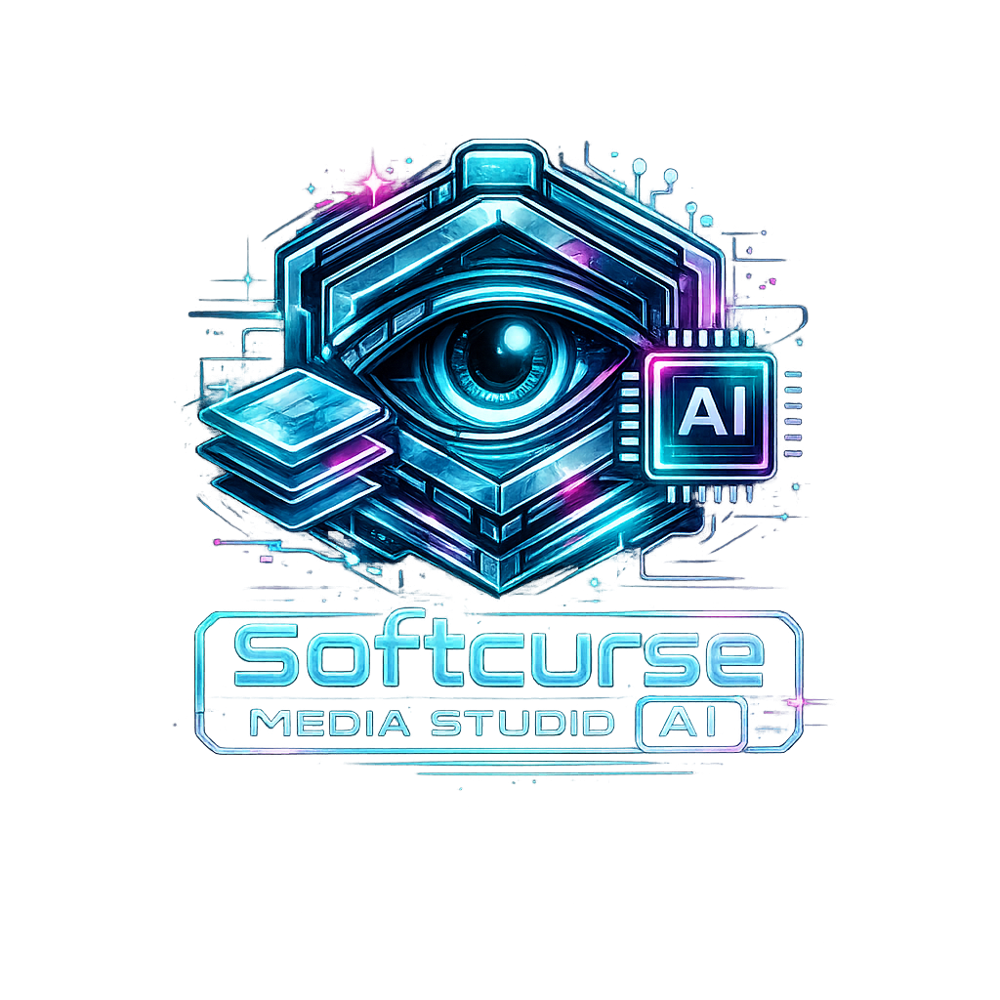

# Softcurse Media Studio AI



A powerful, hardware-accelerated Windows WPF application designed for advanced image manipulation, AI-powered object removal, and generative expansion.

## Features

### Advanced Masking Tools
- **Auto Mode:** Automatically detect and remove watermarks.
- **Cyber Brush:** Paint custom masks for precise inpainting.
- **Eraser:** Refine your masks and protect specific areas.
- **Poly Lasso:** Draw point-to-point geometric masks.
- **Magic Wand (SAM):** Click any object to automatically generate a perfect mask using the Segment Anything Model (SAM).

### AI Image Editing
- **Background Removal:** Instantly strip the background from your images.
- **Retouch (LaMa Inpainting):** Seamlessly remove objects, watermarks, or text using hardware-accelerated LaMa ONNX models (with DirectML GPU support and automatic CPU fallback).
- **Expand:** Outpaint and extend your image boundaries using Stable Diffusion.
- **Upscale:** Enhance your image resolution using AI ESRGAN.
- **Generative Fill:** Inpaint missing or masked regions with custom text prompts using Stable Diffusion.

## Requirements

### Core Application
- Windows 10/11
- [.NET 8.0 SDK or Runtime](https://dotnet.microsoft.com/download)

### AI Generative Features (Optional)
To use the Generative Fill, Expand, and Upscale features, you must have a [Stable Diffusion WebUI](https://github.com/AUTOMATIC1111/stable-diffusion-webui) instance running with the `--api` flag enabled.
- Connect the application to your API via the **Settings** menu (default: `http://127.0.0.1:7860/`).

## How to Run

1. Clone or download the repository.
2. Open a PowerShell terminal in the `gui` folder:
   ```powershell
   cd "d:\Projects\Gemini watermark remover\gui"
   ```
3. Run the application:
   ```powershell
   dotnet run
   ```

## Usage
1. Launch the application and select a tool from the sidebar (Image Editor, Generative Fill, Video Editor).
2. **Settings:** First, configure your Default Output Folder and Stable Diffusion API Endpoint in the Settings tab.
3. **Image Editor:** Drag and drop an image. Select your masking tool from the dropdown (Cyber Brush, Magic Wand, etc.).
4. Draw your mask and click **APPLY MASK (RETOUCH)** to remove the object, or select other tools like **BACKGROUND**, **EXPAND**, or **UPSCALE**.
5. Click **SAVE** to export your final image.

## Technology Stack
- **UI Framework:** Windows Presentation Foundation (WPF) with ModernWpfUI.
- **Image Processing:** OpenCvSharp4.
- **Local AI Inference:** Microsoft.ML.OnnxRuntime (DirectML & CPU).
- **Network API:** HttpClient REST integrations for standard SDAPI payloads.
