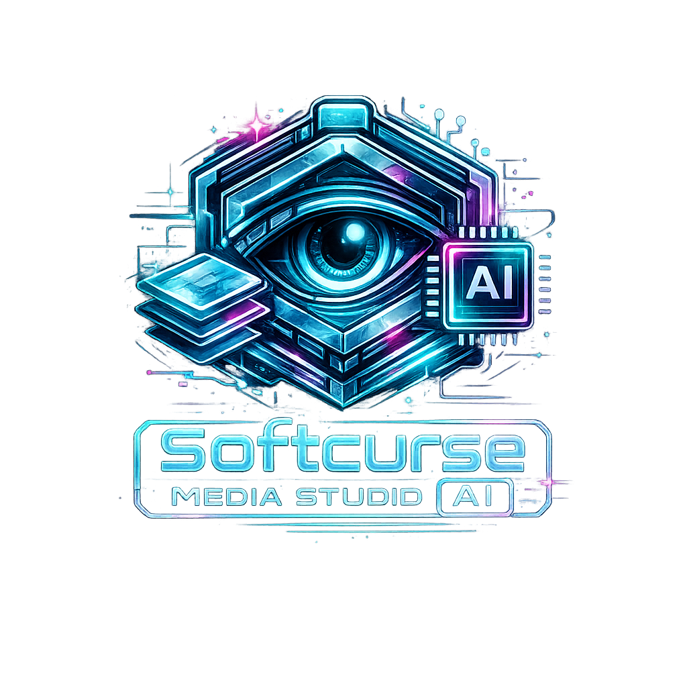

# Softcurse Media Lab AI



A hardware-accelerated Windows WPF application for image manipulation, AI-powered object removal, video/audio conversion, and generative AI expansion.

> **Current application version: v1.0.0**

- **Softcurse Systems:** [softcursesystems.pages.dev](https://softcursesystems.pages.dev)
- **App page and direct website download:** [Softcurse Media Lab AI](https://softcursesystems.pages.dev/lab/medialab)

## Features

### Image Editor
- **Auto Mode:** Automatically detect and remove watermarks using LaMa inpainting
- **Cyber Brush:** Paint custom masks for precise object removal
- **Eraser:** Refine masks and protect specific areas
- **Poly Lasso:** Draw point-to-point geometric masks
- **Smart Select:** Click an object to create a foreground mask using local OpenCV GrabCut
- **Color Picker / Gradient / Text / Layer Mask / Move** tools

### AI-Powered Tools
- **Background Removal:** Instantly strip image backgrounds
- **Retouch (LaMa Inpainting):** Seamlessly remove objects/watermarks using ONNX models (DirectML GPU + automatic CPU fallback)
- **Expand:** Outpaint and extend image boundaries via Stable Diffusion
- **Upscale:** Enhance resolution using AI ESRGAN
- **Blur / Sharpen / Noise:** Filters powered by OpenCV
- **Generative Fill:** Inpaint masked regions with text prompts via Stable Diffusion

### Toolkit Lab — Quick Image Utilities
- **Image Resizer:** Custom dimensions, percentage scale, social media presets (aspect ratio lock)
- **Format Converter:** Batch convert between PNG, JPG, BMP, WebP, TIFF, GIF, ICO (including multi-size ICO), SVG→PNG
- **Color Palette Extractor:** K-means dominant color extraction with hex codes and percentages
- **Image Metadata Viewer:** EXIF data, DPI editor, EXIF stripper
- **Image Compare Slider:** Draggable before/after comparison with swap
- **Crop Tool:** Drag corners/center, 8 aspect ratio presets, dark overlay, pixel-accurate save

### Video Retouch
- **Video Retouch:** Frame-by-frame watermark removal from video files with audio remuxing

### Audio / Video Converter
- **AV Converter:** Dedicated sidebar workflow for batch video/audio conversion via bundled FFmpeg (MP4, MKV, AVI, WebM, MOV, MP3, WAV, AAC, FLAC, OGG)

### Generative Image API (Optional)
- This is an API client, not a bundled image generator. It sends the current Image Editor image, prompt, and optional mask to a separately running Stable Diffusion-compatible WebUI API.
- Without a mask it performs whole-image `img2img`; with a mask it requests inpainting. If you do not use an external trusted server, this module can be ignored.

### Settings & Configuration
- **Execution Provider:** Switch between CPU and DirectML GPU acceleration; the last verified provider is remembered
- **Model Directory:** Custom path for ONNX models (auto-detected by default)
- **API Endpoint:** Configurable SD WebUI connection for generative features
- **Connection Tests:** Verify optional generative API and FFmpeg availability from Settings
- **Bundled FFmpeg:** Works immediately after installation; selecting another `ffmpeg.exe` is an optional advanced override
- **Default Output Folder:** Set your preferred save location

## Requirements

### Core Application
- Windows 10/11 (64-bit)
- No separate runtime or media tools are required: the installer includes .NET 8, FFmpeg, FFprobe, the LaMa model, DirectML, OpenCV, and native dependencies

### AI Generative Features (Optional)
For Generative Fill and Expand, run a compatible [Stable Diffusion WebUI](https://github.com/AUTOMATIC1111/stable-diffusion-webui) API separately.
- Configure API endpoint via **Settings** tab (default: `http://127.0.0.1:7860/`)
- Remote API endpoints receive the images being processed; only configure a server you trust.

The external API is not required for local retouching, automatic watermark detection, background removal, Smart Select, filters, Toolkit Lab, Video Retouch, or AV Converter. Upscale also has a local bicubic fallback.

### GPU Acceleration
- **DirectML** (recommended) — works with any GPU, built into Windows 10+. No extra installation.
- **CPU** — always available as fallback

## Installation

### From Installer
1. Download `SoftcurseMediaLabAI_Setup_v1.0.0.exe` from Releases
2. Run the installer and follow the prompts
3. Launch from desktop shortcut or Start Menu

### From Source
```powershell
git clone https://github.com/Beardicuss/Softcurse-Media-Studio-AI.git
cd Softcurse-Media-Studio-AI
dotnet run --project gui/GeminiWatermarkRemover.csproj
```

### Portable (Publish Folder)
Copy the complete `publish/` folder to any directory and run `SoftcurseMediaLabAI.exe`. The .NET runtime, FFmpeg, FFprobe, and required native components are included.

## Usage
1. Launch the application — sidebar icons animate to indicate the app is ready
2. **Settings:** Configure Default Output Folder, Model Directory, Execution Provider, and API endpoints
3. **Image Editor:** Drag/drop an image or click LOAD IMAGE. Select your tool from the MODE dropdown
4. Draw your mask and click **RETOUCH** to remove objects
5. Use **BG REMOVE**, **EXPAND**, **UPSCALE**, or switch to other modules
6. Click **SAVE** to export results

Open **FAQ / GUIDE** inside the app (Ctrl+7) for searchable, feature-by-feature instructions, requirements, supported audio/video formats, API setup, privacy guidance, shortcuts, and troubleshooting.

## Technology Stack
- **UI Framework:** WPF with ModernWpfUI, custom cyberpunk HUD theme
- **Image Processing:** OpenCvSharp4
- **AI Inference:** Microsoft.ML.OnnxRuntime (DirectML GPU + CPU fallback)
- **Video Processing:** OpenCV VideoCapture/VideoWriter + FFmpeg audio remux
- **Network API:** HttpClient REST for Stable Diffusion API integration

## Verification and performance baseline

Run the complete Release build, automated tests, dependency audit, and repository checks:

```powershell
powershell -ExecutionPolicy Bypass -File scripts/verify.ps1
```

Run the repeatable 1080p image and 720p video-throughput benchmark:

```powershell
powershell -ExecutionPolicy Bypass -File scripts/benchmark.ps1
```

Measure three clean launches of a freshly published build:

```powershell
powershell -ExecutionPolicy Bypass -File scripts/benchmark-startup.ps1
```

The application also records UI-ready time and private memory in its Core health tooltip. The current budgets are 2 seconds to UI readiness and at least 24 fps for 720p video pass-through.

The benchmark also runs real LaMa inference through CPU and DirectML. Provider tests are isolated from saved application settings. If DirectML is rejected by the model/runtime, the application falls back to CPU, remembers the verified provider, and exposes a retry action in Settings for future driver or runtime upgrades.

## Building the Installer
Requires Inno Setup 6 or 7:
```powershell
powershell -ExecutionPolicy Bypass -File scripts/release.ps1 -RequireModel
```
Validated versioned output and SHA-256 checksums are written below `artifacts/release/`. See `RELEASE.md` before public distribution.
